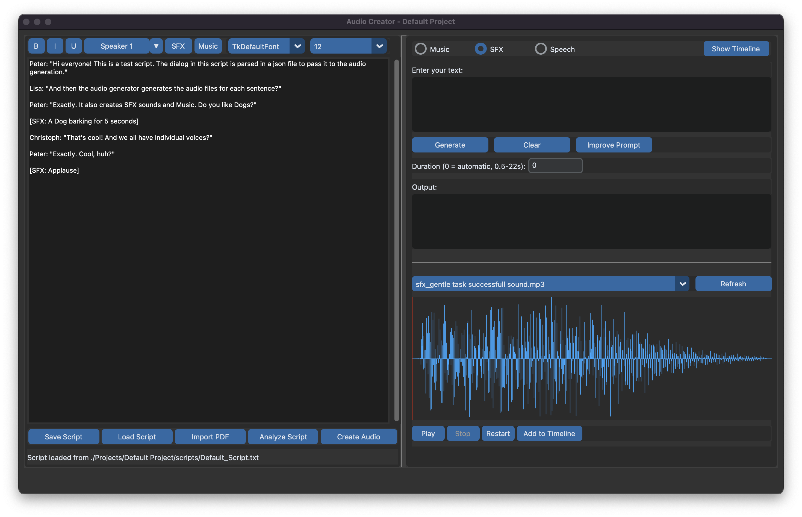

# AI Audio Creator

AI Audio Creator is a Python-based desktop application that combines various AI technologies to help create, edit, and arrange audio content. Perfect for audiobook production, podcast creation, and general audio projects, it integrates multiple AI services to generate music, sound effects, and voice content based on text prompts.



## Features

### Audio Generation
- **AI Music Generation**: Create custom music pieces using text descriptions
- **Sound Effects (SFX)**: Generate sound effects from textual descriptions
- **AI Voice Generation**: Convert text to speech with customizable voices

### Script Editor
- **Rich Text Editing**: Format your scripts with character lines, SFX, and music cues
- **Script Analysis**: Automatically analyze scripts to identify speakers, sound effects, and music cues
- **PDF Import**: Import and convert PDF scripts into the editor format

### Timeline Editor
- **Multi-track Timeline**: Arrange audio clips across multiple tracks
- **Drag & Drop**: Easily arrange audio clips with drag-and-drop functionality
- **Track Controls**: Adjust volume, mute, and solo individual tracks
- **Waveform Visualization**: Visual representation of audio clips
- **Export**: Export your finished project as a single audio file

## Requirements

- Python 3.10 or higher
- Operating System: Windows 10/11, macOS 10.15+, or Linux
- API Keys for:
  - OpenAI (for script analysis and prompt improvement)
  - ElevenLabs (for voice generation)
- Cookie and Session ID for:  (more information below)
  - Suno (for music generation)

## Installation

1. Clone the repository:
```bash
git clone https://github.com/yourusername/ai-audio-creator.git
cd ai-audio-creator
```

2. Create and activate a virtual environment:
```bash
python -m venv venv
source venv/bin/activate  # On Windows use: venv\Scripts\activate
```

3. Install dependencies:
```bash
pip install -r requirements.txt
```

4. Set up environment variables:
   - Copy `.env.example` to `.env`
   - Add your API keys:
     ```
     OPENAI_API_KEY=your_key_here
     ELEVENLABS_API_KEY=your_key_here
     SUNO_COOKIE=your_cookie_here
     SUNO_SESSION_ID=your_session_id_here
     ```
5. Add your Suno-Cookie and Session ID. Instructions for this: https://github.com/gcui-art/suno-api/blob/main/public/get-cookie-demo.gif

6. Run the application:
```bash
python src/main.py
```

## Usage

### Getting Started

1. **Create a New Project**
   - Click File → New Project
   - Enter a project name
   - Choose a save location

2. **Script Writing/Import**
   - Use the script editor on the left side
   - Format text using the toolbar or keyboard shortcuts
   - Import existing scripts using the "Import PDF" button

3. **Audio Generation**
   - Select the appropriate tab (Music, SFX, or Speech)
   - Enter your text prompt
   - Click "Generate" to create audio
   - Preview generated audio in the player below

4. **Timeline Arrangement**
   - Open the timeline window
   - Drag audio clips from the file list to the timeline
   - Arrange clips across multiple tracks
   - Adjust track volumes and settings
   - Export final arrangement

### Keyboard Shortcuts

Script Editor:
- `Ctrl+B`: Bold text
- `Ctrl+I`: Italic text
- `Ctrl+U`: Underline text
- `Ctrl+1-5`: Format as Speaker 1-5
- `Ctrl+F`: Insert SFX marker
- `Ctrl+M`: Insert Music marker

Timeline:
- `Space`: Play/Pause
- `S`: Toggle Solo on selected track
- `M`: Toggle Mute on selected track
- `↑/↓`: Select track above/below
- `Delete`: Remove selected clip
- `Ctrl+Z`: Undo
- `Ctrl+Shift+Z`: Redo

## Project Structure

```
ai_audio_creator/
├── src/                 # Source code
│   ├── models/         # Data models
│   ├── views/          # UI components
│   ├── controllers/    # Application logic
│   ├── services/       # External service integrations
│   └── utils/          # Utility functions
├── config/             # Configuration files
├── docs/               # Documentation
└── Projects/           # Project storage
```

## Configuration

The application can be configured through:
- `config/config.yaml`: Main configuration file
- `.env`: API keys and sensitive information
- Preferences dialog in the application

## Contributing

1. Fork the repository
2. Create a feature branch
3. Commit your changes
4. Push to the branch
5. Create a Pull Request

Please ensure your code follows the project's coding style and includes appropriate tests.

## License

This project is licensed under the GNU LESSER GENERAL PUBLIC License - see the [LICENSE](LICENSE) file for details.

## Support

For support, please:
1. Check the [Documentation](docs/AI_Audio_Creator_User_Manual.md)
2. Search existing [Issues](https://github.com/yourusername/ai-audio-creator/issues)
3. Create a new issue if needed

## Acknowledgments

- OpenAI GPT-4 for script analysis and prompt improvement
- ElevenLabs for voice generation
- Suno for AI music generation
- CustomTkinter for the UI framework
- Suno-API provided by: https://github.com/gcui-art/suno-api/tree/main
